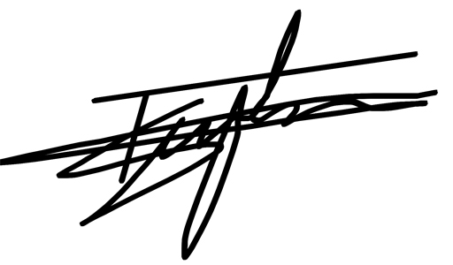

```{r setup, include=FALSE}
knitr::opts_chunk$set(fig.width=1, echo = FALSE, warning = FALSE, message = FALSE)
library(vitae);library(tibble);library(rorcid)
```

\justify

##
##
Dear,  

## 
 


##
Best Regards,  
  
Tanya Strydom  

